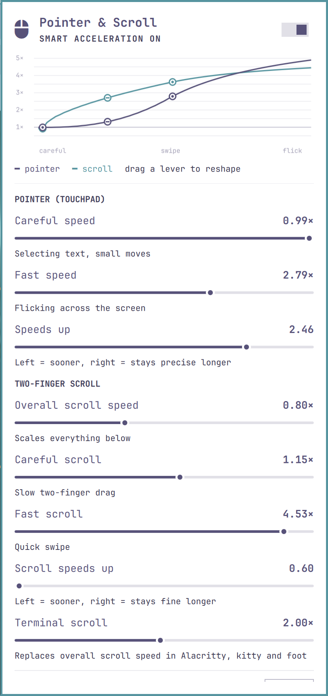

# Pointer & Scroll for Omarchy

A top-bar widget for [Omarchy](https://omarchy.org) that makes your touchpad **precise when you move
slowly and fast when you flick**, for both the pointer and two-finger scrolling, with a live graph
of the curves.



## Why

A single "sensitivity" setting makes every movement faster, so quickly crossing the screen and
carefully selecting a line of text fight each other. libinput supports *custom acceleration
curves* that solve this, and Hyprland exposes them, but writing the curve points by hand is fiddly.
This widget gives you a few intuitive sliders instead and shows the resulting curves as you drag.

## What you can tune

| Section | Slider | What it does |
|---|---|---|
| Pointer | **Careful speed** | Pointer speed when your finger moves slowly (selecting text, small moves) |
| | **Fast speed** | Pointer speed on a quick flick across the screen |
| | **Speeds up** | Left = speeds up early, right = stays precise longer |
| Two-finger scroll | **Overall scroll speed** | Scales all touchpad scrolling (Omarchy's `scroll_factor`) |
| | **Careful scroll** / **Fast scroll** | Slow drag vs quick swipe |
| | **Scroll speeds up** | Same as above, for scrolling |
| | **Terminal scroll** | Touchpad scroll speed inside Alacritty / kitty / foot |

**The chart** shows the real curves: amplification vs finger speed, computed exactly the way
libinput computes it from the points this widget generates, including the part past the last point
where libinput keeps extending the curve. Each curve has three **levers** you can drag up and down,
one per slider:

- **careful** (filled ring, on the curve at the first point) → Careful speed
- **speeds up** (ring with a bar, halfway along) → Speeds up. It shows the smooth formula's bend, so
  the real curve may pass slightly above or below it.
- **fast** (filled ring, on the curve at the last point) → Fast speed

Dragging stops at a slider's limits, where the curve would leave the chart, or where fast would drop
below careful (the curve never slopes downwards).

The switch in the header turns the curves off again (back to a single plain speed slider).
**Reset** asks before restoring the defaults.

The panel behaves like Omarchy's other bar panels (clicking outside it or opening another widget
closes it), but pointer movement and scrolling keep working in other windows while it's open, so
you can test each change immediately. Settings apply when you let go of a slider.

## Install

```sh
omarchy plugin add https://github.com/angusforbes/omarchy-pointer-scroll --enable
```

Click the mouse icon (󰍽) in the top bar, then **Set up**. Setup adds one line to
`~/.config/hypr/input.lua` (backed up to `~/.local/share/omarchy-pointer-scroll/backups/` first):

```lua
require("hypr.pointer_scroll")
```

Requirements: an Omarchy release with the Lua Hyprland config (`~/.config/hypr/hyprland.lua`).

## How it works

- `bin/pointer-scroll` (Python, standard library only) stores your settings in
  `~/.config/hypr/pointer_scroll.json` and generates `~/.config/hypr/pointer_scroll.lua`:
  - a libinput `custom` `accel_profile` and `scroll_points` for each detected touchpad
    (or for all pointer devices if there is no touchpad),
  - the touchpad `scroll_factor` and the terminal scroll multiplier,
  - two non-consuming mouse bindings that close the panel on a click outside it (they do nothing
    while the panel is closed, and the click still reaches whatever you clicked).
- Every change reloads Hyprland; if `hyprctl configerrors` reports a problem the change is rolled back.
- Curve model: finger speed `x` in libinput units/ms (1 ≈ 25 mm/s). The curve spans `x = 0..8`
  (≈ 0–200 mm/s) with `n` points, step `s = 8/n`:
  `amplification(x) = careful` up to the first point, then
  `careful + (fast - careful) * ((x - s) / (8 - s)) ^ speeds_up` up to the last point.
  libinput joins the points with straight lines (in output speed) and keeps extending the last
  segment, so hard flicks go faster still.

### Advanced: number of curve points

`curve_points` (default **16**, range 4–32) sets how many points libinput gets per curve. More
points = a smoother curve (fewer visible corners) and a narrower flat "careful" zone at the start;
fewer points = a wider careful zone with corners. It's a settings-file option, not a slider:

```sh
~/.config/omarchy/plugins/angusforbes.pointer-scroll/bin/pointer-scroll set curve_points 8
```

(or edit `~/.config/hypr/pointer_scroll.json` and run `pointer-scroll apply`).

The command line works too:

```sh
~/.config/omarchy/plugins/angusforbes.pointer-scroll/bin/pointer-scroll get
~/.config/omarchy/plugins/angusforbes.pointer-scroll/bin/pointer-scroll set pointer_fast 2.2 scroll_speed 0.6
```

## Uninstall

```sh
~/.config/omarchy/plugins/angusforbes.pointer-scroll/bin/pointer-scroll uninstall
omarchy plugin remove angusforbes.pointer-scroll
```

`uninstall` removes the `require` line and the generated config and reloads Hyprland; your
settings file is kept.

## License

MIT
